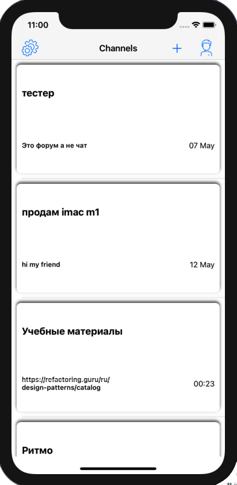
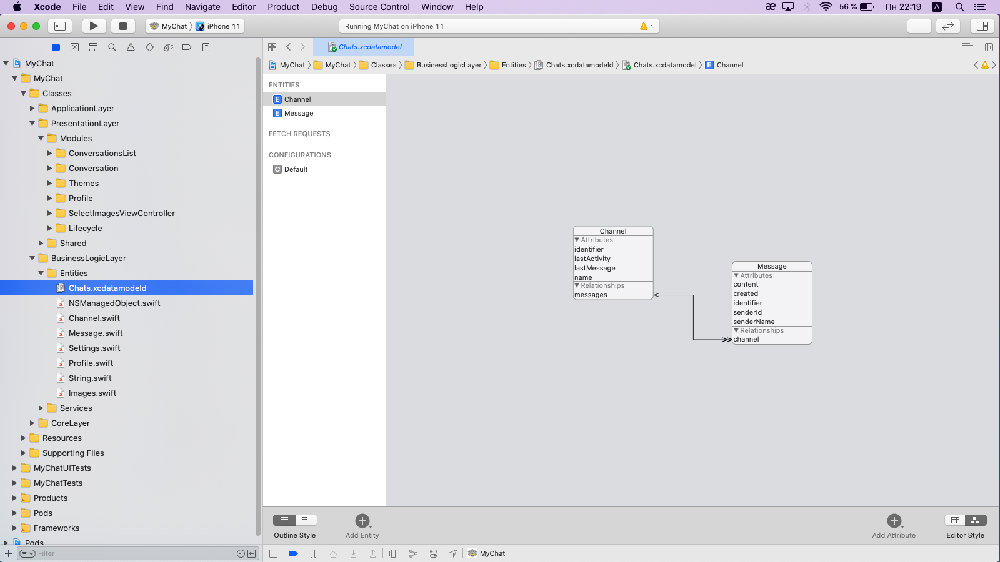

# MyChat

MyChat - Messaging app

https://youtu.be/AutfI1ee7xM

Used:
- Swift
- CocoaPods
- Protocols
- Extension
- MapKit
- WebKit
- CoreLocation
- Core Data
- DispatchQueue
- Autolayout
- MVC
- Interface Builder
- Storyboard/Xib
- JSON
- Localizable
- MFMailComposeViewController

UIKit:
- UITabBarController
- UIPageViewController
- UIViewController
- UIStoryboardSegue
- UIStoryboardUnwindSegueSource
- UITableViewController
- UITableViewCell
- UICollectionView
- UIRefreshControl
- Basic UIView Animation
- UIBlurEffect
- UIToolbar
- UISearchController
- UIAlertController
- UIBarButtonItem
- UIImagePickerController
- UIProgressView

Foundation:
- URLSession
- NSPredicate
- DateFormatter
- NumberFormatter
- UserDefaults
- NSCache
- Timer

GitHub Actions 
