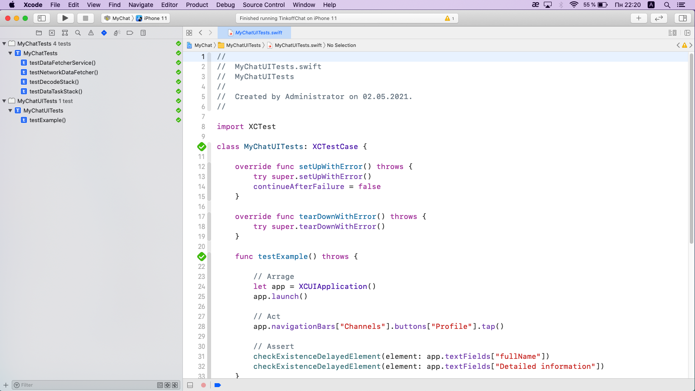
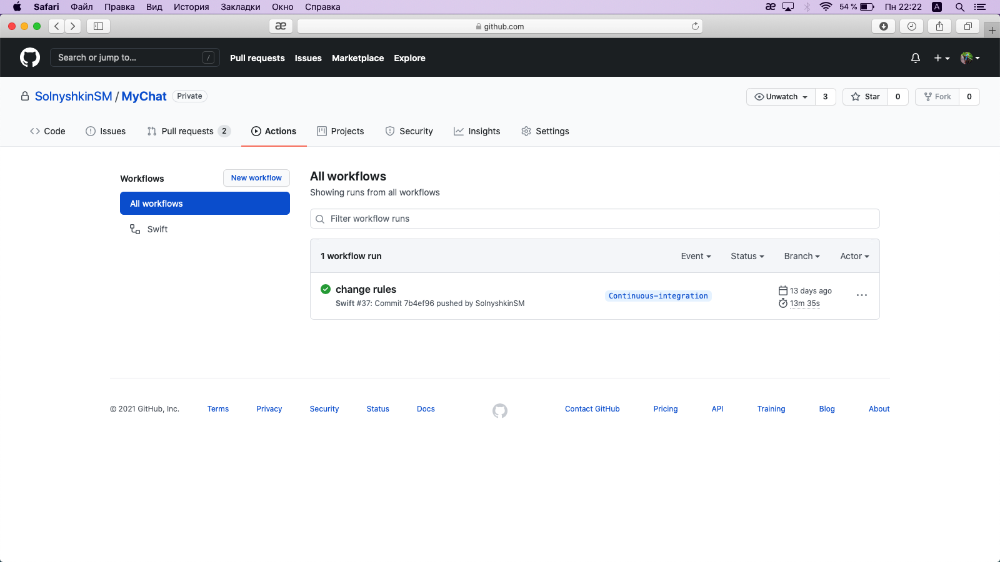
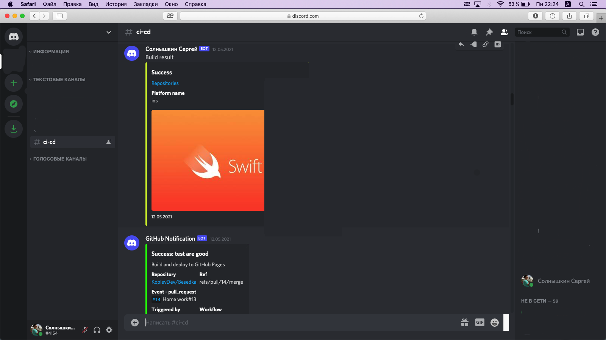

# MyChat

MyChat - Messaging app

https://youtu.be/5HvS1OcKrtc

Used:
- Swift
- CocoaPods
- Protocols
- Extension
- Firebase
- Core Data
- DispatchQueue
- Autolayout
- MVC
- Interface Builder
- Storyboard/Xib
- JSON

UIKit:
- UITabBarController
- UIPageViewController
- UIViewController
- UIStoryboardSegue
- UIStoryboardUnwindSegueSource
- UITableViewController
- UITableViewCell
- UICollectionView
- UIRefreshControl
- UIView Animation
- Core Animation
- UIToolbar
- UISearchController
- UIAlertController
- UIBarButtonItem
- UIImagePickerController
- UIProgressView

Foundation:
- URLSession
- NSPredicate
- DateFormatter
- NumberFormatter
- UserDefaults

GitHub Actions 
